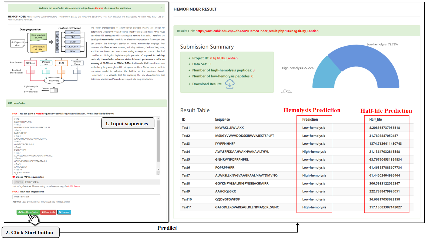

# HemoFinder

**HemoFinder** is a newly introduced tool in **dbAMP 3.0**, designed to predict the **hemolytic activity** and **half-life** of antimicrobial peptides (AMPs). This tool assists users in identifying AMPs with better **drug-like potential**, supporting peptide-based drug discovery.

---

## 🧬 Workflow

HemoFinder follows a structured machine learning pipeline to analyze AMPs.  

---

## 🔬 Features & Methodology

HemoFinder integrates **five widely used peptide descriptors** to capture the sequence and physicochemical characteristics of AMPs:

- **AAC**: Amino Acid Composition  
- **DPC**: Dipeptide Composition  
- **PAAC**: Pseudo Amino Acid Composition  
- **CKSAAGP**: Composition of k-spaced Amino Acid Group Pairs  
- **PHYC**: Physicochemical Properties

These features are fed into a set of **machine learning base learners**, including:

- XGBoost  
- Decision Tree  
- K-Nearest Neighbors (KNN)  
- Random Forest

The final classifier is built using a **soft voting strategy**, enhancing prediction robustness by leveraging the strengths of each base learner. This ensemble approach allows HemoFinder to **accurately identify peptides with high hemolytic potential**.

---

## 🌐 Online Access

We have developed a **user-friendly website interface** for HemoFinder, making it easy for researchers and developers to access the tool without requiring any programming knowledge.

🔗 **Try it now**: [https://awi.cuhk.edu.cn/~dbAMP/HemoFinder.php](https://awi.cuhk.edu.cn/~dbAMP/HemoFinder.php)  

---

## 📫 Contact

For more information or technical support, please visit the [dbAMP Homepage](https://awi.cuhk.edu.cn/~dbAMP/) or contact the development team.

---
